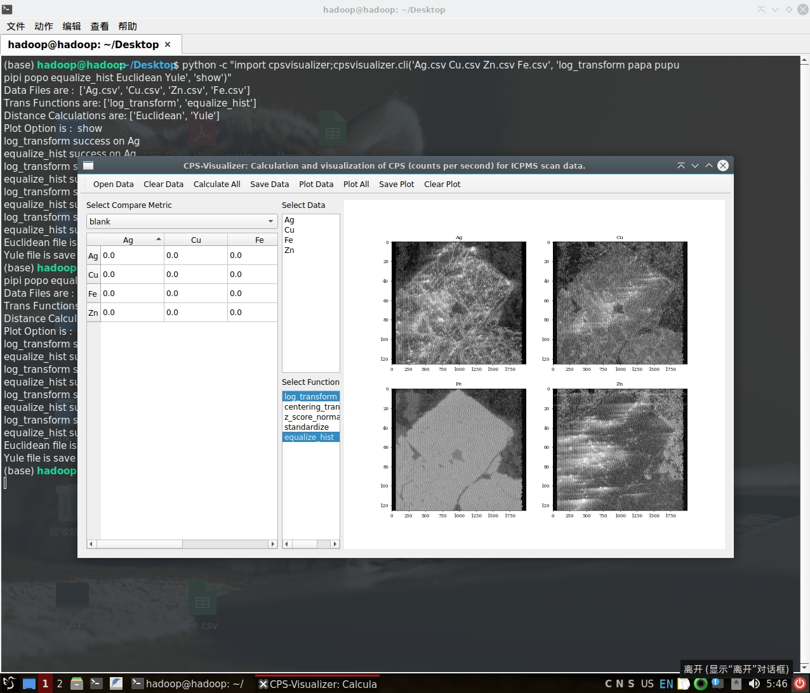
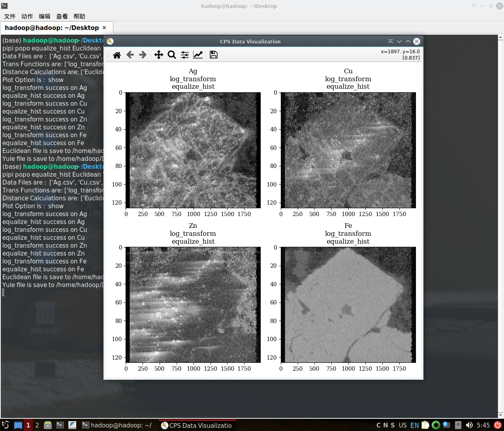

# CPS-Visualizer

CPS-Visualizer is a Python package that calculates and visualizes CPS (counts per second) for ICPMS scan data.
It provides a command-line interface (CLI) and a graphical user interface (GUI) for users to easily calculate and visualize CPS data. The package is designed to be user-friendly and easy to use, with a simple and intuitive interface.

## Features

- Support for surface data visualization for ICPMS scan data
- Export CPS data to CSV files
- Support for multiple data files as multiple components
- Support for various data processing methods, such as log_transform,centering_transform,z_score_normalization,standardize and equalize_hist
- Support for various distance metrics, such as Euclidean, Manhattan, Chebyshev, Minkowski, Cosine, Correlation, Jaccard, Dice, Kulsinski, Rogers-Tanimoto, Russell-Rao, Sokal-Michener, Sokal-Sneath, Yule,Hsim_Distance,Close_Distance, Mutual Information and SSIM (structural similarity index)

## Installation

The package is available on PyPI and can be installed using pip. It is compatible with Python 3.12 and above.
Developed with Python and Pyside6, theoretically it should work on any platform that supports Python and Pyside6.
However, due to the limitations of our current development environment, we have only tested the package on Windows 11 and Ubuntu 24.04.

### Additional Steps on Ubuntu

If you are using Ubuntu, you may need to install some additional dependencies.

```Bash
sudo apt update
sudo apt install libxcb-cursor0
sudo apt install libxcb-xinerama0 libxcb-icccm4 libxcb-image0 libxcb-keysyms1 libxcb-render-util0 libxcb-xkb1 libxkbcommon-x11-0
```

### Installation with Pip

To use this application, python 3.12 or above is required, which can be downloaded from the official website. Python installation related resources and instructions can be found at https://www.python.org/downloads/.

When finished installing Python, you need to install some depencies using pip:

```Bash
pip install matplotlib numpy==1.26.4 pandas PySide6 scipy scikit-learn scikit-image
```

Then you can install the `cpsvisualizer` package using pip:

```Bash
pip install cpsvisualizer
```

## Usage

This package provides two interfaces: a command-line interface (CLI) and a graphical user interface (GUI).
You can choose to use either interface based on your needs.


### Graphical User Interface (GUI)


After the installation, you can run the application by executing the following commands to run a GUI:

```Bash
python -c "import cpsvisualizer;cpsvisualizer.gui()"
```

Then there will coms the gui, which will look like this:



The GUI is really quite straightforward, just check it out and you will be able to use it.

### Command-Line Interface (CLI)

Alternatively, you can run the application from the command line:

```Bash
cd path/to/data/files # always cd to the location of your data files first
python -c "import cpsvisualizer;cpsvisualizer.cli('Ag.csv Cu.csv Zn.csv Fe.csv', 'log_transform papa pupu pipi popo equalize_hist Euclidean Yule', 'silent')" # silent mode
python -c "import cpsvisualizer;cpsvisualizer.cli('Ag.csv Cu.csv Zn.csv Fe.csv', 'log_transform papa pupu pipi popo equalize_hist Euclidean Yule', 'show')" # show the plot
```

As shown above, the command line interface takes three arguments: the path to the data files, the processing methods, and the mode (silent or show).

The processing methods can be selected from the following set of commands, and the order in which they are listed is the order in which the corresponding processing methods are applied, so be sure to pay attention to the order.

The available methods for converting data are shown in the table below:
        `log_transform`,`centering_transform`,`z_score_normalization`,`standardize`,`equalize_hist`

The method of calculating the distance for each pair of data can be selected from the list below:
        `Euclidean`,`Manhattan`,`Chebyshev`,`Minkowski`,`Cosine`,`Correlation`,`Jaccard`,`Dice`,`Kulsinski`,`Rogers_Tanimoto`,`Russell_Rao`,`Sokal_Michener`,`Sokal_Sneath`,`Yule`,`mutual_info_regression_flattern`,`mutual_info_regression_unflattern`,`mutual_info_score_flattern`,`mutual_info_score_unflattern`,`calculate_ssim`,`luminance`,`contrast`,`structure`,`Hsim_Distance`,`Close_Distance`

The last opition can be 'silent' or 'show', the former means save the plots as png, pdf and svg files directly, the latter means show the plots in the GUI and require user to save the plots manually.

### Output of the CLI

The CLI silent mode will output the following information to the console:

```Bash
(base) hadoop@hadoop:~$ cd Desktop
(base) hadoop@hadoop:~/Desktop$ python -c "import cpsvisualizer;cpsvisualizer.cli('Ag.csv Cu.csv Zn.csv Fe.csv', 'log_transform papa pupu pipi popo equalize_hist Euclidean Yule', 'silent')"
Data Files are :  ['Ag.csv', 'Cu.csv', 'Zn.csv', 'Fe.csv']
Trans Functions are: ['log_transform', 'equalize_hist']
Distance Calculations are: ['Euclidean', 'Yule']
Plot Option is :  silent
log_transform success on Ag
equalize_hist success on Ag
log_transform success on Cu
equalize_hist success on Cu
log_transform success on Zn
equalize_hist success on Zn
log_transform success on Fe
equalize_hist success on Fe
Euclidean file is save to /home/hadoop/Desktop/Euclidean.csv
Yule file is save to /home/hadoop/Desktop/Yule.csv
PNG file saved at: /home/hadoop/Desktop/CPS_Data_Visualization.png
PDF file saved at: /home/hadoop/Desktop/CPS_Data_Visualization.pdf
SVG file saved at: /home/hadoop/Desktop/CPS_Data_Visualization.svg
```

The CLI show mode will output the following information to the console:

```Bash
(base) hadoop@hadoop:~$ cd Desktop
(base) hadoop@hadoop:~/Desktop$ python -c "import cpsvisualizer;cpsvisualizer.cli('Ag.csv Cu.csv Zn.csv Fe.csv', 'log_transform papa pupu pipi popo equalize_hist Euclidean Yule', 'show')"
Data Files are :  ['Ag.csv', 'Cu.csv', 'Zn.csv', 'Fe.csv']
Trans Functions are: ['log_transform', 'equalize_hist']
Distance Calculations are: ['Euclidean', 'Yule']
Plot Option is :  silent
log_transform success on Ag
equalize_hist success on Ag
log_transform success on Cu
equalize_hist success on Cu
log_transform success on Zn
equalize_hist success on Zn
log_transform success on Fe
equalize_hist success on Fe
Euclidean file is save to /home/hadoop/Desktop/Euclidean.csv
Yule file is save to /home/hadoop/Desktop/Yule.csv
```

And there will come a plot window to show the results.



## License

This project is licensed under the GNU Affero General Public License V3 - see the [LICENSE](LICENSE) file for details.
