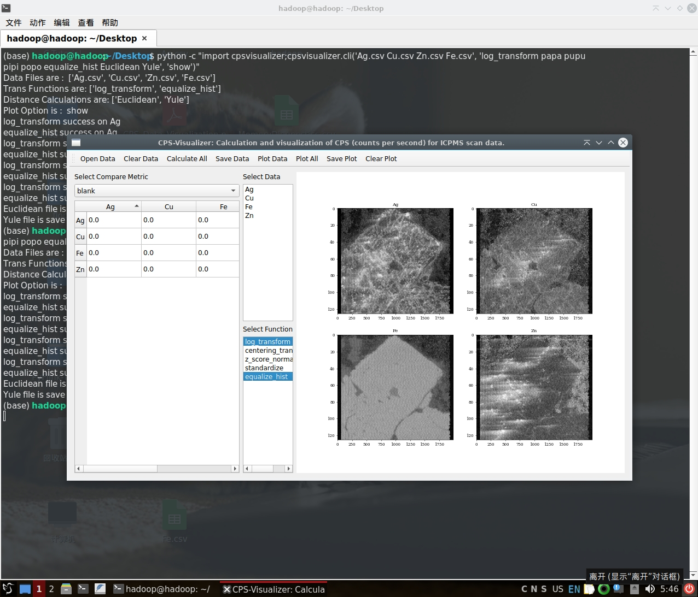
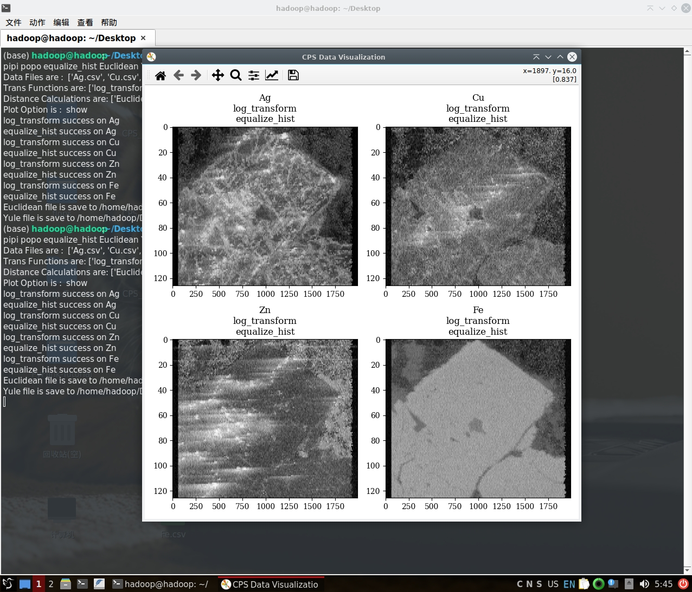

# CPS-Visualizer

CPS-Visualizer 是一个 Python 包，用于计算和可视化 LA-ICP-MS 扫描数据的 CPS（每秒计数）。
它提供了命令行界面（CLI）和图形用户界面（GUI），方便用户计算和可视化 CPS 数据。该包设计友好、易于使用，界面简洁直观。

## 功能特点

- 支持 LA-ICP-MS 扫描数据的表面数据可视化
- 将 CPS 数据导出为 CSV 文件
- 支持将多个数据文件作为多个分量
- 支持多种数据处理方法，如 log_transform、centering_transform、z_score_normalization、standardize 和 equalize_hist
- 支持多种距离度量，如欧氏距离、曼哈顿距离、切比雪夫距离、闵可夫斯基距离、余弦距离、相关距离、杰卡德距离、骰子距离、库尔辛斯基距离、罗杰斯-塔尼莫托距离、罗素-劳距离、索卡尔-米切纳距离、索卡尔-斯尼斯距离、尤尔距离、Hsim_Distance、Close_Distance、互信息和 SSIM（结构相似性指数）

## 用于更直观可视化的预处理函数

我们开发了一系列预处理函数，可用于对数据进行变换以实现更直观的可视化。

* log_transform：

$$
Log(data) = \ln(1 + data)
$$

`log_data = np.log1p(data)`。其数学含义是计算 `1 + data` 的自然对数。在处理接近零的小值时，此函数比直接计算 `np.log(data)` 更精确。具体来说，它返回 `ln(1 + data)`，其中 `ln` 表示自然对数（以 e 为底的对数）。

* centering_transform：

$$
Centered(data) = data - Mean(data)
$$

`centered_data = data - np.mean(data, axis=0)`。此函数将每列的均值从输入数据的相应列中减去。结果是一个新数组，其中每个元素等于输入数据中对应元素减去该列均值。

* z_score_normalization：

$$
Normalized_{z\_score}(data) = \frac{data - \mu}{\sigma}
$$

`normalized_data = (data - np.mean(data, axis=0)) / np.std(data, axis=0)`。此函数通过对每列减去均值并除以标准差来归一化数据。结果是一个新数组，其中每个元素等于输入数据中对应元素减去该列均值，再除以该列标准差。

* standardize：

$$
Standardized_{(Min-Max)}(data) = \frac{data - \min(data)}{\max(data) - \min(data)}
$$

`standardized_data = (data - np.min(data, axis=0)) / (np.max(data, axis=0) - np.min(data, axis=0))`。此函数通过对每列减去最小值并除以极差（最大值 - 最小值）来标准化数据。结果是一个新数组，其中每个元素等于输入数据中对应元素减去该列最小值，再除以该列极差。

* equalize_hist：

$$
\mathrm{Equalized\_data}(x, y) = \frac{CDF(data(x, y)) - CDF_{\min}}{1 - CDF_{\min}}
$$

其中：
- $data(x, y)$ 是位置 $(x, y)$ 处的像素值。
- $CDF$ 是数据直方图的累积分布函数。
- $CDF_{\min}$ 是 CDF 的最小非零值。

`equalized_data = exposure.equalize_hist(data)`。此函数对数据应用直方图均衡化。直方图均衡化是一种通过重新分配像素强度值来改善图像对比度的技术。它的工作原理是创建像素强度的直方图，然后均衡化该直方图，使像素强度在可能值范围内均匀分布。结果是经过直方图均衡化后的新数组。

## 相似性度量

我们开发了一系列相似性度量，可用于计算数据点之间的相似性。

### 传统距离度量

* 欧氏距离（Euclidean）

$$
d(x, y) = \sqrt{\sum_{i=1}^{n}(x_i - y_i)^2}
$$

`euclidean_distance = np.sqrt(np.sum((data1 - data2) ** 2))`。此函数计算数据点之间的欧氏距离。欧氏距离是欧几里得空间中两点之间的"普通"直线距离。通过取两个数据点对应元素差的平方和的平方根来计算。

* 曼哈顿距离（Manhattan）

$$
d(x, y) = \sum_{i=1}^{n}|x_i - y_i|
$$

`manhattan_distance = np.sum(np.abs(data1 - data2))`。此函数计算数据点之间的曼哈顿距离。曼哈顿距离是两个数据点对应元素绝对差之和。也称为 L1 范数或出租车距离。

* 切比雪夫距离（Chebyshev）

$$
d(x, y) = \max_{i}|x_i - y_i|
$$

`chebyshev_distance = np.max(np.abs(data1 - data2))`。此函数计算数据点之间的切比雪夫距离。切比雪夫距离是两个数据点对应元素的最大绝对差。也称为 L∞ 范数或棋盘距离。

* 闵可夫斯基距离（Minkowski）

$$
d(x, y) = \Big(\sum_{i=1}^{n}|x_i - y_i|^p\Big)^{1/p}
$$

`minkowski_distance = np.sum(np.abs(data1 - data2) ** p) ** (1/p)`。此函数计算数据点之间的闵可夫斯基距离。闵可夫斯基距离是一种广义度量，可用于衡量赋范向量空间中两点之间的距离。通过取两个数据点对应元素绝对差的 p 次幂之和的 p 次方根来计算。

* 余弦距离（Cosine）

$$
\cos(\theta) = \frac{x \cdot y}{\|x\|\|y\|}
$$

`cosine_similarity = 1 - spatial.distance.cosine(data1, data2)`。此函数计算数据点之间的余弦相似度。余弦相似度是内积空间中两个非零向量之间夹角余弦值的度量。通过取两个数据点的点积并除以两个数据点模的乘积来计算。

* 相关距离（Correlation）

$$
r = \frac{\sum_{i=1}^{n}(x_i - \bar{x})(y_i - \bar{y})}{\sqrt{\sum_{i=1}^{n}(x_i - \bar{x})^2}\sqrt{\sum_{i=1}^{n}(y_i - \bar{y})^2}}
$$

`correlation_coefficient = np.corrcoef(data1, data2)[0, 1]`。此函数计算数据点之间的相关系数。相关系数是两个变量之间线性关系的度量。通过取两个数据点的协方差并除以两个数据点标准差的乘积来计算。

* 杰卡德距离（Jaccard）

$$
J(A, B) = \frac{|A \cap B|}{|A \cup B|} = \frac{a}{a + b + c}
$$

`jaccard_similarity = spatial.distance.jaccard(data1, data2)`。此函数计算数据点之间的杰卡德相似度。杰卡德相似度是两个集合之间相似性的度量。通过取两个集合交集的大小并除以两个集合并集的大小来计算。

* 骰子距离（Dice）

$$
D(A, B) = \frac{2|A \cap B|}{|A| + |B|} = \frac{2a}{2a + b + c}
$$

`dice_similarity = 2 * np.sum(data1 * data2) / (np.sum(data1 ** 2) + np.sum(data2 ** 2))`。此函数计算数据点之间的骰子相似度。骰子相似度是两个集合之间相似性的度量。通过取两倍交集大小并除以两个集合大小之和来计算。

* 库尔辛斯基距离（Kulsinski）

$$
K(A, B) = \frac{|A \triangle B| + n - |A \cap B|}{|A \cup B| + n - |A \cap B|} = \frac{b + c + n - a}{a + b + c + n - a}
$$

`kulsinski_distance = spatial.distance.kulsinski(data1, data2)`。此函数计算数据点之间的库尔辛斯基距离。库尔辛斯基距离是两个集合之间不相似度的度量。通过取两个集合并集的大小并减去交集的大小来计算。

* 罗杰斯-塔尼莫托距离（Rogers-Tanimoto）

$$
RT(A, B) = \frac{|A \cap B| + |\overline{A} \cap \overline{B}|}{|A \cup B| + |\overline{A} \cup \overline{B}|} = \frac{a + d}{a + d + 2(b + c)}
$$

`rogers_tanimoto_similarity = 1 - spatial.distance.rogerstanimoto(data1, data2)`。此函数计算数据点之间的罗杰斯-塔尼莫托相似度。罗杰斯-塔尼莫托相似度是两个集合之间相似性的度量。通过取两个集合交集的大小并除以两个集合大小之和减去交集大小来计算。

* 罗素-劳距离（Russell-Rao）

$$
RR(A, B) = \frac{|A \cap B|}{n} = \frac{a}{a + b + c + d}
$$

`russell_rao_similarity = np.sum(np.minimum(data1, data2)) / np.sum(data1 + data2)`。此函数计算数据点之间的罗素-劳相似度。罗素-劳相似度是两个集合之间相似性的度量。通过取两个集合交集的大小并除以两个集合大小之和来计算。

* 索卡尔-米切纳距离（Sokal-Michener）

$$
SM(A, B) = \frac{|A \cap B| + |\overline{A} \cap \overline{B}|}{n} = \frac{a + d}{a + b + c + d}
$$

`sokal_michener_similarity = np.sum(np.minimum(data1, data2)) / np.sum(np.maximum(data1, data2))`。此函数计算数据点之间的索卡尔-米切纳相似度。索卡尔-米切纳相似度是两个集合之间相似性的度量。通过取两个集合交集的大小并除以两个集合大小之和减去交集大小来计算。

* 索卡尔-斯尼斯距离（Sokal-Sneath）

$$
SS(A, B) = \frac{|A \cap B|}{|A \cap B| + 2|A \triangle B|} = \frac{a}{a + 2(b + c)}
$$

`sokal_sneath_similarity = np.sum(np.minimum(data1, data2)) / np.sum(data1 + data2)`。此函数计算数据点之间的索卡尔-斯尼斯相似度。索卡尔-斯尼斯相似度是两个集合之间相似性的度量。通过取两个集合交集的大小并除以两个集合大小之和减去交集大小来计算。

* 尤尔距离（Yule）

$$
Y(A, B) = \frac{|A \cap B| \cdot |\overline{A} \cap \overline{B}| - |A \setminus B| \cdot |B \setminus A|}{|A \cap B| \cdot |\overline{A} \cap \overline{B}| + |A \setminus B| \cdot |B \setminus A|} = \frac{ad - bc}{ad + bc}
$$

`yule_coefficient = spatial.distance.yule(data1, data2)`。此函数计算数据点之间的尤尔系数。尤尔系数是两个集合之间不相似度的度量。通过取两个集合并集的大小并减去交集的大小来计算。

其中 $a = |A \cap B|$，$b = |A \setminus B|$，$c = |B \setminus A|$，$d = |\overline{A} \cap \overline{B}|$，$n = a + b + c + d$。

### 高维距离

这些函数用于计算高维数据点之间的距离，已部分集成到 `GeoPyTool` 应用中。

* Hsim_Distance

$$
\mathrm{Hsim}(x_i, x_j)=\frac{\sum_{k=1}^n \frac{1}{1+|x_{ik}-x_{jk}|}}{n}
$$

* Close_Distance

$$
\mathrm{Close}(x_i, x_j)=\frac{\sum_{k=1}^n e^{-|x_{ik}-x_{jk}|}}{n}
$$

### 互信息

互信息是一个随机变量包含的关于另一个随机变量的信息量的度量。

带有 `_flattern` 后缀的函数是在将矩阵数据展平后直接计算互信息，不考虑原始数据矩阵形式的结构信息；带有 `_unflattern` 后缀的函数是按列计算矩阵的互信息然后取平均值，考虑了矩阵的结构信息。

* mutual_info_regression

包括 `mutual_info_regression_flattern` 和 `mutual_info_regression_unflattern`，用于回归任务，衡量连续特征与连续目标变量之间的依赖关系。

* mutual_info_score

包括 `mutual_info_score_flattern` 和 `mutual_info_score_unflattern`，用于分类任务，衡量两个分类变量之间的依赖关系。

### 结构相似性

结构相似性指数（SSIM）是一种衡量两幅图像之间相似性的方法。它度量图像中的结构信息，对亮度、对比度和噪声的变化具有鲁棒性。

* calculate_ssim

此函数计算两个矩阵作为图像之间的结构相似性指数（SSIM）。SSIM 是图像中结构信息的度量，对亮度、对比度和噪声的变化具有鲁棒性。该函数以两幅图像作为输入，返回两幅图像之间的 SSIM 值。

* luminance

此函数仅返回两个矩阵作为图像之间的亮度差异。亮度是图像亮度的度量，计算为图像中像素强度的平均值。

* contrast

此函数仅返回两幅图像之间的对比度差异。对比度是图像最亮和最暗部分之间亮度差异的度量。

* structure

此函数仅返回两幅图像之间的结构差异。结构是图像形状和纹理差异的度量。

## 安装

该包可在 PyPI 上获取，可使用 pip 安装。兼容 Python 3.12 及以上版本。
基于 Python 和 PySide6 开发，理论上可在任何支持 Python 和 PySide6 的平台上运行。
但由于当前开发环境的限制，我们仅在 Windows 11 和 Ubuntu 24.04 上测试过该包。

### Ubuntu 上的额外步骤

如果您使用 Ubuntu，可能需要安装一些额外的依赖。

```bash
sudo apt update
sudo apt install libxcb-cursor0
sudo apt install libxcb-xinerama0 libxcb-icccm4 libxcb-image0 libxcb-keysyms1 libxcb-render-util0 libxcb-xkb1 libxkbcommon-x11-0
```

### Windows 安装

如果您使用 Windows 11 及以上版本，可以从以下链接下载打包文件：[https://pan.baidu.com/s/1F-RFVtzELEoOlSAkViuSsA?pwd=cugb](https://pan.baidu.com/s/1F-RFVtzELEoOlSAkViuSsA?pwd=cugb)，提取码为 `cugb`。

上述链接中有两个文件，`CPS-Visualizer-1.0.msi` 和 `CPS-Visualizer-1.0.zip`。
`CPS-Visualizer-1.0.msi` 可以双击安装。
`CPS-Visualizer-1.0.zip` 可以解压到文件夹，然后运行文件夹中的 `CPS-Visualizer-1.0.exe` 文件。

### 使用 Pip 安装

使用此应用程序需要 Python 3.12 或更高版本，可从官网下载。Python 安装相关资源和说明可在 https://www.python.org/downloads/ 找到。

安装完 Python 后，需要使用 pip 安装一些依赖：

```bash
pip install matplotlib numpy==1.26.4 pandas PySide6 scipy scikit-learn scikit-image
```

然后可以使用 pip 安装 `cpsvisualizer` 包：

```bash
pip install cpsvisualizer
```

## 使用方法

该包提供两种界面：命令行界面（CLI）和图形用户界面（GUI）。
您可以根据需要选择使用任一界面。

### 图形用户界面（GUI）

安装完成后，可以通过执行以下命令来运行 GUI：

```bash
python -c "import cpsvisualizer;cpsvisualizer.gui()"
```

然后会出现 GUI，界面如下所示：



GUI 非常直观，试一试就能上手。

### 命令行界面（CLI）

或者，您也可以从命令行运行应用程序：

```bash
cd path/to/data/files # 先 cd 到数据文件所在目录
python -c "import cpsvisualizer;cpsvisualizer.cli('Ag.csv Cu.csv Zn.csv Fe.csv', 'log_transform papa pupi pipi popo equalize_hist Euclidean Yule', 'silent')" # 静默模式
python -c "import cpsvisualizer;cpsvisualizer.cli('Ag.csv Cu.csv Zn.csv Fe.csv', 'log_transform papa pupi pipi popo equalize_hist Euclidean Yule', 'show')" # 显示图表
```

如上所示，命令行界面接受三个参数：数据文件路径、处理方法和模式（silent 或 show）。

处理方法可从以下命令集中选择，列出的顺序即为相应处理方法应用的顺序，请注意顺序。

可用于数据转换的方法如下：

`log_transform`、`centering_transform`、`z_score_normalization`、`standardize`、`equalize_hist`

可用于计算每对数据距离的方法可从以下列表中选择：

`Euclidean`、`Manhattan`、`Chebyshev`、`Minkowski`、`Cosine`、`Correlation`、`Jaccard`、`Dice`、`Kulsinski`、`Rogers_Tanimoto`、`Russell_Rao`、`Sokal_Michener`、`Sokal_Sneath`、`Yule`、`mutual_info_regression_flattern`、`mutual_info_regression_unflattern`、`mutual_info_score_flattern`、`mutual_info_score_unflattern`、`calculate_ssim`、`luminance`、`contrast`、`structure`、`Hsim_Distance`、`Close_Distance`

最后一个选项可以是 'silent' 或 'show'，前者表示直接将图表保存为 png、pdf 和 svg 文件，后者表示在 GUI 中显示图表并需要用户手动保存。

### CLI 输出示例

CLI 静默模式将输出以下信息到控制台：

```bash
(base) hadoop@hadoop:~$ cd Desktop
(base) hadoop@hadoop:~/Desktop$ python -c "import cpsvisualizer;cpsvisualizer.cli('Ag.csv Cu.csv Zn.csv Fe.csv', 'log_transform papa pupi pipi popo equalize_hist Euclidean Yule', 'silent')"
Data Files are :  ['Ag.csv', 'Cu.csv', 'Zn.csv', 'Fe.csv']
Trans Functions are: ['log_transform', 'equalize_hist']
Distance Calculations are: ['Euclidean', 'Yule']
Plot Option is :  silent
log_transform success on Ag
equalize_hist success on Ag
log_transform success on Cu
equalize_hist success on Cu
log_transform success on Zn
equalize_hist success on Zn
log_transform success on Fe
equalize_hist success on Fe
Euclidean file is saved to /home/hadoop/Desktop/Euclidean.csv
Yule file is saved to /home/hadoop/Desktop/Yule.csv
PNG file saved at: /home/hadoop/Desktop/CPS_Data_Visualization.png
PDF file saved at: /home/hadoop/Desktop/CPS_Data_Visualization.pdf
SVG file saved at: /home/hadoop/Desktop/CPS_Data_Visualization.svg
```

CLI 显示模式将输出以下信息到控制台：

```bash
(base) hadoop@hadoop:~$ cd Desktop
(base) hadoop@hadoop:~/Desktop$ python -c "import cpsvisualizer;cpsvisualizer.cli('Ag.csv Cu.csv Zn.csv Fe.csv', 'log_transform papa pupi pipi popo equalize_hist Euclidean Yule', 'show')"
Data Files are :  ['Ag.csv', 'Cu.csv', 'Zn.csv', 'Fe.csv']
Trans Functions are: ['log_transform', 'equalize_hist']
Distance Calculations are: ['Euclidean', 'Yule']
Plot Option is :  silent
log_transform success on Ag
equalize_hist success on Ag
log_transform success on Cu
equalize_hist success on Cu
log_transform success on Zn
equalize_hist success on Zn
log_transform success on Fe
equalize_hist success on Fe
Euclidean file is saved to /home/hadoop/Desktop/Euclidean.csv
Yule file is saved to /home/hadoop/Desktop/Yule.csv
```

然后会弹出一个图表窗口来显示结果。



## 许可证

本项目基于 GNU Affero 通用公共许可证 V3 授权 - 详情请参阅 [LICENSE](LICENSE) 文件。